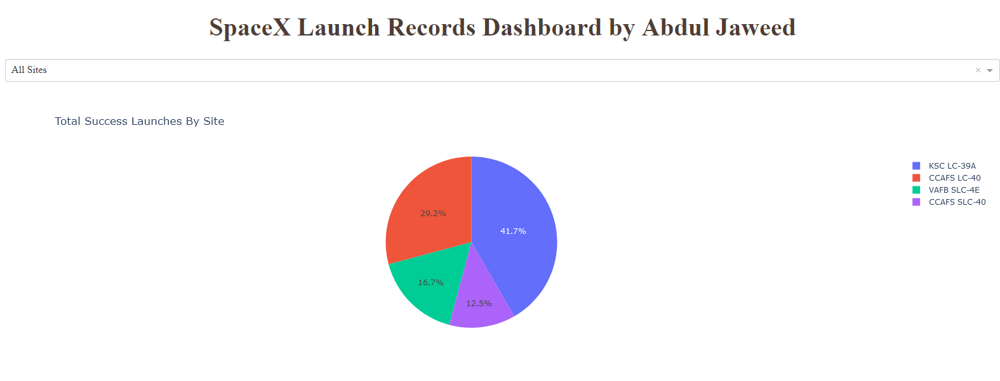

# SpaceX Falcon 9 Landing Prediction

**Falcon 9 Rocket Family**  

## Project Description:

The main goal of this project is to predict whether the Falcon 9 first stage will land successfully. SpaceX prides itself in being able to reuse the first stage of a rocket launch so much so that they advertise on their website that their rocket launches cost 62 million while other providers cost upward 165 million. Much of these savings are down to the first stage's reusability. If we can determine if the first stage will land, we can determine the cost of a launch. This information can be used if an alternate company wants to bid against SpaceX for a rocket launch. 

This brings us to our main question that we are trying to answer: **For a given set of features
about a Falcon 9 rocket launch, will the first stage of the rocket land successfully?**

The methodolgy followed will include Data Dollection, Data Wrangling and Preprocessing, Exploratory Data Analysis, Data Visualization and finally, Machine Learning Prediction. 

During our investigation, the results of our analysis indicate that there are some features of rocket launches that have a correlation with the success or failure launches. 

In the end we conclude that the Decision Tree may be the best machine learning algorithm for this problem.

**For the full project report you can check out the PDF in this repository** 

## Table Of Contents:

The project includes eight Jupyter Notebooks, one Powerpoint Presentation and one PDF (same as PPT):

1. Space-X Data Collection API

2. Data Collection with Web Scraping

3. EDA with Pandas and Numpy

4. EDA with SQL

5. EDA with Data Visualisation

6. Interactive Map Analytics with Folium

7. Space-X Dashboard

8. Deploying Dashboard

8. Space-X Machine Learning Prediction

## 1. Space-X Data Collection API

- The API used is <a href="https://api.spacexdata.com/v4/rockets/" target="_blank">here</a>.
- The API provides data about types of rocket launches done by SpaceX
- The data is cleaned and exported to CSV for analysis

## 2. Data Collection with Web Scraping

- We perform web scraping to collect Falcon 9 historical launch records from a <a href="https://en.wikipedia.org/wiki/List_of_Falcon_9_and_Falcon_Heavy_launches" target="_blank">Wikipedia page</a>.
- The data is cleaned and exported to CSV for analysis

Snippet of the wikipedia page:  

## 3. Exploratory Data Analysis

We perform some Exploratory Data Analysis (EDA) to find some patterns in the data and determine what would be the label for training supervised models.

In the data set, there are several different cases where the booster did not land successfully. Sometimes a landing was attempted but failed due to an accident; for example, `True Ocean` means the mission outcome was successfully landed to a specific region of the ocean while `False Ocean` means the mission outcome was unsuccessfully landed to a specific region of the ocean. `True RTLS` means the mission outcome was successfully landed to a ground pad `False RTLS` means the mission outcome was unsuccessfully landed to a ground pad. `True ASDS` means the mission outcome was successfully landed on a drone ship `False ASDS` means the mission outcome was unsuccessfully landed on a drone ship.

Successful landing example:  

Unsuccessful landing example:  

## 4. Exploratory Data Analysis with SQL

We use SQL to query the database and answer several questions about the data such as:
- The names of the unique launch sites in the space mission
- The total payload mass carried by boosters launched by NASA (CRS)
- The average payload mass carried by booster version F9 v1.1

Some of the SQL statements or functions used include SELECT, DISTINCT, AS, FROM, WHERE, LIMIT, LIKE, SUM(), AVG(), MIN(), BETWEEN, COUNT(), and YEAR().

## 5. Exploratory Data Analysis with Data Visualization

- We use Python's Matplotlib and Seaborn libraries to visualize the relationships that exist within the dataset. 
- The "One-Hot Encoding" technique is used to create binary category variables as part of the Feature Engineering

Visualizing the success rate in each orbit:

Class 1 = Success    
Class 0 = Failure  

## 6. Interactive Map Analytics with Folium

In this notebook we perform the following:
- Mark all Launch Sites on a Map 
- Mark the Success/Failed Launches for each Site on the Map 
- Calculate the Distances Between a Launch Site to its Proximities 

This is all done using Folium, a Python mapping library that allows for the creation of interactive maps.

Launch sites:  

Success or Failed Launches for each Site :  

Launch site proximities distances such as railway line, main road and coast:  

## 7. Space-X Dashboard

Dashboard link : "https://spacex-falcon9-landing-prediction.onrender.com/". Click on the link and the dashboard will open up in your browser.  

## 8. Space-X Machine Learning Prediction

In this notebook we perform the following:

- Creating Column for “Class”
- Standardizing the data
- Splitting data for training and testing
- Find the best hyperparameter 
- Matrix Model Evaluation
  

## Conclusion:

- The analysis showed that there is a positive correlation between number of flights and success rate as the success rate has improved over the years. 
- The results of the (EDA) exploratory data analysis revealed the success rate of the SpaceX Falcon 9 rocket landings is 66%.
- Orbit ES-L1, GEO, HEO, and SSO has a 100% success rates. 
- I deploy this dashboard on render web hosting service for better experience.
- Except Decision Tree the other three model like K Nearest Neighbors, Support Vector Machine and Logistic Regression Machine Learning Algorithms perform same accuracy 83%.